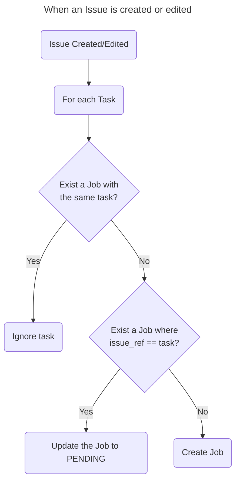
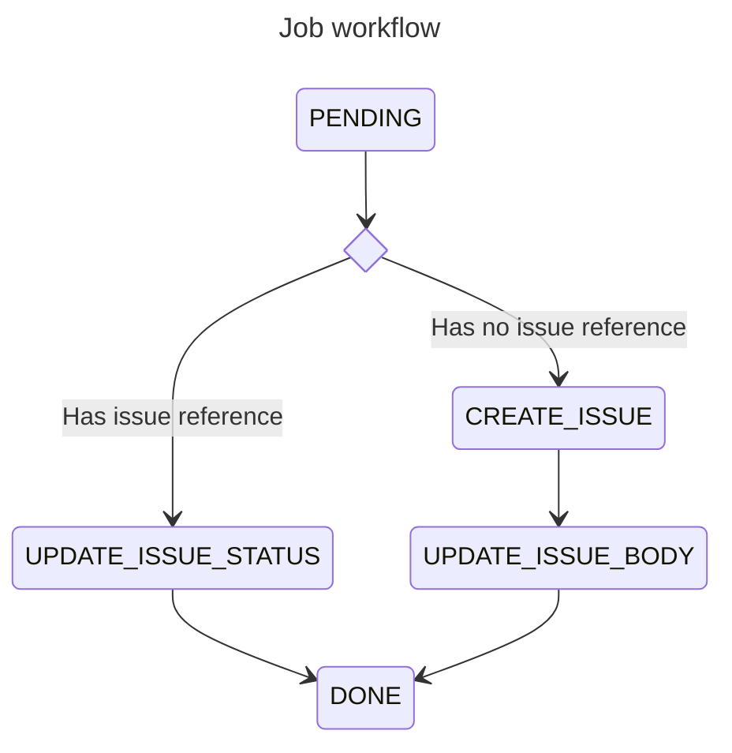

```mermaid
---
title: When an Issue is created or edited
---
flowchart TD
issue_created(Issue Created/Edited)
for_each_task(For each Task)
exist_job{Exist a Job with<br>the same task?}
ignore_task(Ignore task)
exist_prior_job{Exist a Job where<br>issue_ref == task?}
change_status_pending(Update the Job to PENDING)
create_job(Create Job)

issue_created --> for_each_task
for_each_task --> exist_job

exist_job -- Yes --> ignore_task
exist_job -- No --> exist_prior_job

exist_prior_job -- Yes --> change_status_pending
exist_prior_job -- No --> create_job
```

```mermaid
---
title: Job workflow
---
stateDiagram-v2

state if_issue_ref <<choice>>

PENDING --> if_issue_ref
if_issue_ref --> UPDATE_ISSUE_STATUS: Has issue reference
if_issue_ref --> CREATE_ISSUE: Has no issue reference
CREATE_ISSUE --> UPDATE_ISSUE_BODY 
UPDATE_ISSUE_STATUS --> DONE
UPDATE_ISSUE_BODY --> DONE
```
